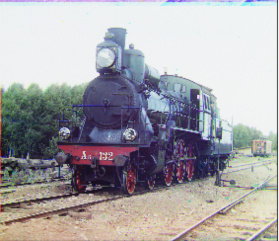

# Camille's CS 180 Portfolio!

## Project 1: Prokudin-Gorskii :) 

### Overview
This project is based on bringing color to the Prokudin-Gorskii photo collection. Sergei Mikhailovich Prokudin-Gorskii was convinced that there would eventually be colored photos. So in the early 1900s, he took a bunch of pictures, recording three exposures of every scene he took onto a glass plate using a red, green, and blue filter. He never got to piece them together to make a colored image, but we can now! So cool!

### Example of the input image from the Prokudin-Gorskii photo collection:

### Naive Approach
I first started by taking each image (which has the 'red', 'green', and 'blue' filtered images stacked upon each other, as shown above) and extracting the three separate images. Then, I created an align function that takes in two images, and returns the best x and y offset that minimizes a loss between the first image's position according to the second image within an exhaustive search of a given window, finding the closest similarity between the two images as possible. I used the Euclidean distance as my loss function and searched over window sizes of [-15, 15] to find the x and y offset that returned the lowest Euclidean distance between the pixels of the first and second image.
Once the offset is found, we adjust the image accordingly.

I effectively used this method for all three jpg files, using the blue channel as the base image.

### Further Improvements:
After the naive implementation, I also implemented a crop function that takes in an image and a percentage, and returns the image after cropping that percentage of the image. I 
I then applied this function to each of the R, G, and B images, cropping each image by around 15% to get rid of borders that made channel alignment less accurate.
I also implemented the NCC align function and added the option to add various loss functions in the align function, but ended up preferring and using the Euclidean norm for the rest of my images.

### Examples:

| | | 
|:-------------------------:|:-------------------------:|
| Cathedal Image Without Alignment|   With Alignment *aligned on blue channel* Green: (), Red()|
| Monastery Image Without Alignment|   With Alignment *aligned on blue channel* Green: (), Red()|
| Tobolsk Image Without Alignment |   With Alignment *aligned on blue channel* Green: (), Red()|

### Implementing the Image Pyramid
This does not work for larger images because the computation and iteration for the align function is far too expensive with larger pixels. Thus, I implemented a recursive image pyramid that downscales an image and base image by 2 until it reaches a certain smaller limit (which I initially set as a 512-pixel limit on either the width or the height), which is when I call my align function to receive the optimal offset x and y. 

### Further Improvements
My code was running at about 1.5 minutes, and thus to optimize, I triedrecursing to a smaller base case and also changing the pixel window to smaller

### Examples:

emir gradient offsets: 
red: 41, 105
green: 24, 49

emir reg offsets:
-630, 153
24, 49

emir base green offsets:
17, 57
-24, -49

cburch:
-4, 58
4, 25

harvesters:
13, 124
16, 59

sculpture:
-27, 140
-11, 33

lady:
11, 112
9, 49

icon:
red: 23, 89
green: 17, 40
==
cathedral:
3, 12
2, 5

monastery:
2, 3
2, -3

tobolsk:
3,6
2,3 
==

melons:
13, 179
10, 82

train:
32, 87
5, 42

onion_church:
36, 108
26, 51

self-portrait:
37, 176
29, 78

three generations:
11, 112
14, 53

| | | 
|:-------------------------:|:-------------------------:|

| Church w/ base blue alignment |  |
|  |  |
| Emir with blue base alignment |  |

### Bells and Whistles: Better Features - Gradients
I tried another 

### Bells and Whistles: Automatic Cropping

